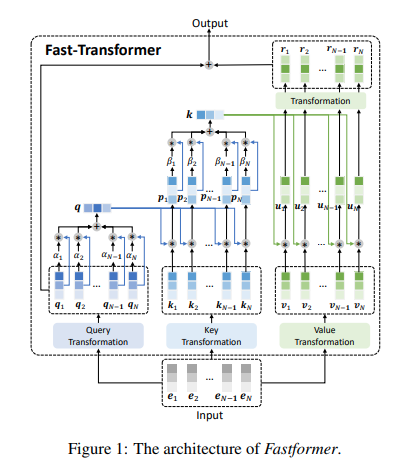

</img>

## Fast Transformer - Pytorch

Implementation of <a href="https://arxiv.org/abs/2108.09084">Fast Transformer</a> in Pytorch. This only work as an encoder.

<a href="https://www.youtube.com/watch?v=qgUegkefocg">Yannic video</a>

<a href="https://www.youtube.com/watch?v=Ich5TIvdYRE">AI Epiphany</a>

## Install

```bash
$ pip install fast-transformer-pytorch
```

## Usage

```python
import torch
from fast_transformer_pytorch import FastTransformer

model = FastTransformer(
    num_tokens = 20000,
    dim = 512,
    depth = 2,
    max_seq_len = 4096,
    absolute_pos_emb = True   # default uses relative positional encoding, but if that isn't working, then turn on absolute positional embedding by setting this to True
)

x = torch.randint(0, 20000, (1, 4096))
mask = torch.ones(1, 4096).bool()

logits = model(x, mask = mask) # (1, 4096, 20000)
```

## Citations

```bibtex
@misc{wu2021fastformer,
    title   = {Fastformer: Additive Attention is All You Need}, 
    author  = {Chuhan Wu and Fangzhao Wu and Tao Qi and Yongfeng Huang},
    year    = {2021},
    eprint  = {2108.09084},
    archivePrefix = {arXiv},
    primaryClass = {cs.CL}
}
```
